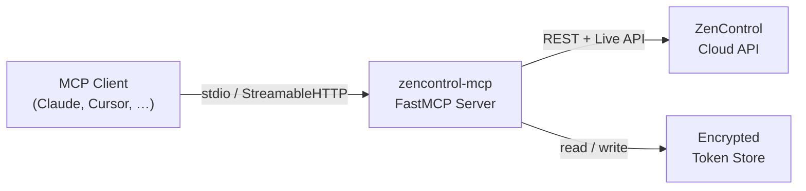

# zencontrol-mcp

MCP server for ZenControl DALI-2 lighting control.


## Overview

**zencontrol-mcp** enables AI assistants — such as Claude, Cursor, and other
MCP-compatible clients — to discover and control
[ZenControl](https://zencontrol.com/) DALI-2 lighting systems through natural
language.

Built on the [Model Context Protocol](https://modelcontextprotocol.io/) (MCP)
with [FastMCP](https://github.com/jlowin/fastmcp), the server supports two
transports:

- **stdio** — for local, single-user setups (Claude Desktop, Cursor, etc.)
- **StreamableHTTP** — for hosted / multi-user deployments

## Documentation

- User guide: this README
- Maintainer guide: [CONTRIBUTING.md](CONTRIBUTING.md)
- Coding agent guidance: [AGENTS.md](AGENTS.md)

## Features

| Tool | Description |
|------|-------------|
| `list_sites` | Discover accessible ZenControl sites |
| `get_site_details` | Explore site hierarchy (floors, zones, gateways, tenancies) |
| `list_groups` | List lighting groups by scope (site, floor, map, or gateway) |
| `list_devices` | List devices and their ECGs by scope |
| `control_light` | On/off, dim, set level (0–100 %), recall scenes, identify |
| `set_colour` | Colour temperature (Kelvin) or RGBWAF control |

## Prerequisites

- **Python 3.11+**
- **ZenControl Cloud account** with API credentials (`client_id` and
  `client_secret`) — request them from
  [ZenControl Support](https://support.zencontrol.com/hc/en-us/requests/new)
- **[uv](https://docs.astral.sh/uv/)** package manager (recommended) or `pip`

## Quick Start

1. **Set your credentials:**

   ```bash
   export ZENCONTROL_CLIENT_ID=your_client_id
   export ZENCONTROL_CLIENT_SECRET=your_client_secret
   ```

2. **Run with `uvx`:**

   ```bash
   uvx zencontrol-mcp
   ```

   On first launch a browser window will open so you can log in to ZenControl.
   After that, tokens are cached and refreshed automatically.

## Configuration

### Claude Desktop (stdio mode)

Add the following to your Claude Desktop configuration file:

```json
{
  "mcpServers": {
    "zencontrol": {
      "command": "uvx",
      "args": ["zencontrol-mcp"],
      "env": {
        "ZENCONTROL_CLIENT_ID": "your_client_id",
        "ZENCONTROL_CLIENT_SECRET": "your_client_secret"
      }
    }
  }
}
```

### HTTP mode (hosted)

Start the server on a network port:

```bash
uvx zencontrol-mcp --transport streamable-http --port 9000
```

Then point your MCP client at the HTTP endpoint:

```json
{
  "mcpServers": {
    "zencontrol": {
      "url": "http://localhost:9000/mcp"
    }
  }
}
```

### Environment Variables

| Variable | Required | Default | Description |
|----------|----------|---------|-------------|
| `ZENCONTROL_CLIENT_ID` | Yes | — | OAuth client ID |
| `ZENCONTROL_CLIENT_SECRET` | Yes | — | OAuth client secret |
| `ZENCONTROL_REDIRECT_URI` | No | `http://localhost:9000/callback` | OAuth redirect URI |
| `ZENCONTROL_PORT` | No | `9000` | HTTP server port |

## Authentication

The server uses **OAuth 2.0 Authorization Code** flow to authenticate with the
ZenControl Cloud API.

1. On first run the server opens your default browser so you can log in.
2. Tokens are stored **encrypted** in a platform-appropriate location (via
   [`platformdirs`](https://github.com/tox-dev/platformdirs)).
3. Tokens are **refreshed automatically** when they expire — you should rarely
   need to re-authenticate.

## Usage Examples

Typical interactions with an AI assistant:

```text
User: "What sites do I have access to?"
→ Calls list_sites

User: "Show me the structure of the Main Office site"
→ Calls get_site_details

User: "Turn on all lights in the Lobby group"
→ Calls control_light(target_type="group", target_id="...", action="on")

User: "Set the office lights to 50% brightness"
→ Calls control_light(target_type="group", target_id="...", action="set_level", level=50)

User: "Change the lobby to warm white (3000K)"
→ Calls set_colour(target_type="group", target_id="...", mode="temperature", kelvin=3000)
```

## Core Tool Families

- Site discovery: `list_sites`, `get_site_details`
- Topology inventory: `list_groups`, `list_devices`, `list_gateways`, `list_device_locations`
- Lighting control: `control_light`, `set_colour`, `set_profile`
- Live telemetry: `get_live_light_levels`, `get_sensor_readings`, `get_system_variables`
- Diagnostics: `get_device_health`
- Scope controls: `set_scope`, `get_scope`, `clear_scope`

## Safe Control Workflow

1. Start with `list_sites`.
2. Resolve a concrete target with `get_site_details` or `list_groups`.
3. Prefer controlling groups over individual devices.
4. Use moderate levels first (for example, 30-50%) before full output.
5. Use scope controls to avoid cross-site mistakes in multi-site environments.

## Troubleshooting

- `Required environment variable(s) not set`:
  - Set `ZENCONTROL_CLIENT_ID` and `ZENCONTROL_CLIENT_SECRET` for stdio mode.
- HTTP 401 on live endpoints:
  - Verify account entitlement for Live API and valid token scope.
- HTTP 403 on diagnostics:
  - Account may not have access to diagnostics endpoints.
- `get_site_details` parsing inconsistencies:
  - This server tolerates both label payload shapes (`{"value": "..."}` and plain strings).

## Architecture



## Development

```bash
git clone https://github.com/oWretch/zencontrol-mcp.git
cd zencontrol-mcp
uv sync

# Lint & format
uv run ruff check src/
uv run ruff format --check src/

# Run tests
uv run pytest

# Generate full API docs (Markdown)
uv run python scripts/generate_docs.py
```

Generated documentation entry points:

- `docs/reference/api.md`

See [CONTRIBUTING.md](CONTRIBUTING.md) for full guidelines.

## API Payload Compatibility Notes

Some ZenControl payloads can represent labels in two shapes:

- Wrapped sync field: `{ "value": "Office", "state": "OK", "error": null }`
- Plain string: `"Office"`

The server accepts both formats for label fields (for example, tenancy and floor
labels) so tools such as `get_site_details` remain robust across mixed API
responses.

## License

This project is licensed under the [MIT License](LICENSE).
